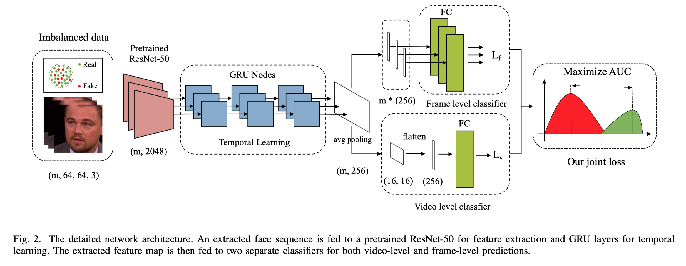

# Learning a Deep Dual-level Network for Robust DeepFake Detection

Wenbo Pu<sup>1</sup>, Jing Hu<sup>1</sup>, Xin Wang<sup>2</sup>, Yuezun Li<sup>3</sup>, Bin Zhu<sup>4</sup>, Bin Kong<sup>2</sup>, Youbing Yin<sup>2</sup>, Qi Song<sup>2</sup>,  Xi Wu<sup>1</sup>, Siwei Lyu<sup>5</sup>

<sup>1</sup>Chengdu University of Information Technology, Chengdu, China; <sup>2</sup>Keya Medical, Seattle, USA; <sup>3</sup>Ocean University of China; <sup>4</sup>Microsoft Research Asia, Beijing, China; <sup>5</sup>University at Buffalo, State University of New York, USA.


## Overview



## Imbalanced Performance


## Requirements

- Pytorch 1.4.0
- Ubuntu 16.04
- CUDA 10.0
- Python 3.6

## Usage

- To train a model, use 

  ```shell
  python train.py
  ```

- To test a model, use

  ```shell
  python test.py
  ```

We provided our method, Xception, FWA, Mesonet, Capsule and others to train and test in this repository. Go to `config.py` to change the configurations.

## Training data preparation

We provided a script to generate training and test data for this repository. Use `make_train_test.py`.

## Notice

This repository is NOT for commecial use. It is provided "as it is" and we are not responsible for any subsequence of using this code.
