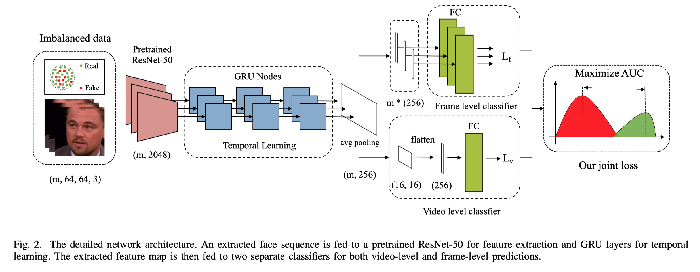

# Learning a Deep Dual-level Network for Robust DeepFake Detection


## Overview



## Imbalanced Performance


## Info

We provided our method, Xception<sup>6</sup>, FWA<sup>7</sup>, MesoNet<sup>8</sup>, Capsule<sup>9</sup> and others to train and test in this repository. Xception and FWA can be train or test at `main.py` while the other methods can be found in their individual folders, such as Capsule in `capsule/`.

Except the model proposed in our paper, we also provided many variants of our model, including VIT, ResVIT and DCTNet<sup>10</sup> for replacement of ResNet, and CRNN for replacement of RNN.

We also implemented Face X-ray for data-augumentation ( not used in our paper ), if you are interested in, go check `utils/dataloader.py`.

The implementation of AUC loss we proposed in our paper can be found in `utils/aucloss.py`.

Our checkpoint can be found [here](https://drive.google.com/file/d/144ol1u4Kz4HwOsG3qvEeVqH8bpqCvaOU/view?usp=sharing).


## Requirements

- Pytorch 1.4.0
- Ubuntu 16.04
- CUDA 10.0
- Python 3.6
- Dlib 19.0

## Usage 

- We provide a demo to show how our model work. See `demo/demo.py`
  ```shell
  python demo.py --restore_from restore_from -- path video path
  ```

- To train and test a model, use 

  ```shell
  python main.py -i input_path -r restore_from -g gpu_id
  ```

- More parameters can be adjusted in `main.py`.

## Training data preparation

We provided a script to generate training and test data for this repository. Use `make_train_test.py`. This script can preprocess FaceForensics++, Celeb-DF and DFDC datasets using [MTCNN](https://github.com/ipazc/mtcnn) or [Dlib](https://github.com/davisking/dlib/).

## Notice

This repository is NOT for commecial use. It is provided "as it is" and we are not responsible for any subsequence of using this code.


## Thanks

<sup>6</sup> [FaceForensics++ Learning to Detect Manipulated Facial Images](https://github.com/ondyari/FaceForensics) </br>
<sup>7</sup> [Exposing DeepFake Videos By Detecting Face Warping Artifacts](https://github.com/yuezunli/CVPRW2019_Face_Artifacts) </br>
<sup>8</sup> [MesoNet - a Compact Facial Video Forgery Detection Network](https://github.com/DariusAf/MesoNet) </br>
<sup>9</sup> [USE OF A CAPSULE NETWORK TO DETECT FAKE IMAGES AND VIDEOS](https://github.com/raohashim/DFD) ( third-party implementation ) </br>
<sup>10</sup> [Learning in the Frequency Domain](https://github.com/calmevtime/DCTNet)
